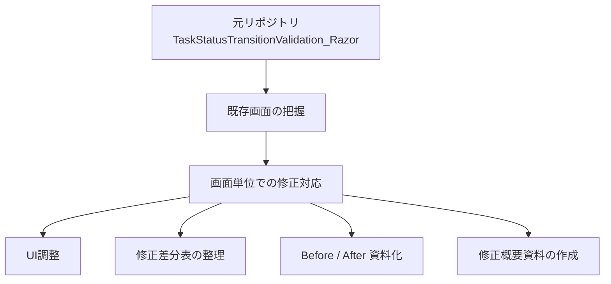
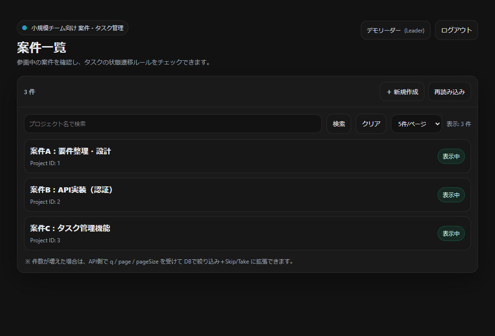
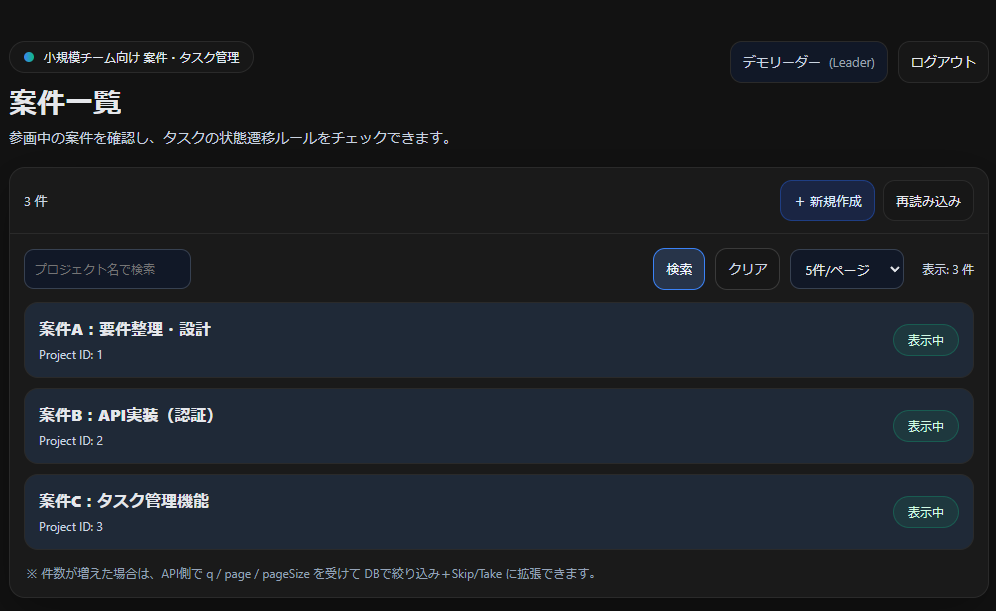

# 画面設計書修正・UI改修サンプル集（Razor Pages）

## 概要

本リポジトリは、既存の Razor Pages 制作物である  
[TaskStatusTransitionValidation_Razor](https://github.com/fewioaghwrao/TaskStatusTransitionValidation_Razor)  
を題材に、**画面設計書修正スキル** および **既存画面のUI改修スキル** を整理・可視化することを目的としたサンプル集です。

既存画面を前提として、文言や業務仕様は維持しつつ、主に以下の観点で画面改善を行います。

- 視認性の向上
- 操作性の向上
- 修正差分の整理
- Before / After による比較
- 画面単位でのCSS調整および影響範囲の確認

---

## 元リポジトリとの関係

本リポジトリで扱う修正対象は、以下の既存リポジトリに含まれる画面です。

- 元リポジトリ: [TaskStatusTransitionValidation_Razor](https://github.com/fewioaghwrao/TaskStatusTransitionValidation_Razor)

本リポジトリでは、元画面の構成やレイアウトを踏まえたうえで、**既存画面改修の一環としてUI調整・資料整理を実施**しています。

---

## 位置づけ



---

## 対象画面

本リポジトリでは、以下の画面を対象に順次修正内容を整理していきます。

| 画面 | 状態 | 主な内容 |
|---|---|---|
| ログイン画面 | 追加予定 | 入力欄・ボタン・説明文などの視認性改善 |
| 案件一覧画面 | 対応済み | ヘッダー、検索条件、一覧表示、ページャのUI調整 |
| タスク一覧画面 | 追加予定 | 一覧性、検索条件、状態表示、操作導線の改善 |

---

## 対応方針

本リポジトリでの画面修正は、以下の方針で実施します。

- 文言は変更しない
- 業務仕様は変更しない
- 既存レイアウトを大きく崩さない
- 配色、文字サイズ、余白、ボタン強調表現を中心に見直す
- 必要に応じて画面単位の専用CSSを追加する
- 共通スタイルへの影響範囲を意識して修正を行う
- 修正内容は差分資料として整理する

---

## 対応内容の例

画面ごとに、主に以下のような観点で修正を行います。

- 画面タイトル、説明文の見やすさ改善
- 入力欄やセレクトボックスの視認性向上
- 主操作ボタンと補助操作ボタンの見分けやすさ改善
- 一覧行の区切り、補足情報、状態表示の見やすさ向上
- ページャや注釈文の余白・配色調整
- Before / After による画面比較資料の整理

---

## 現在の対応状況

### 1. 案件一覧画面

案件一覧画面では、既存UIの見直しの一環として CSS を調整し、ヘッダー部、検索条件エリア、案件一覧表示部を中心に **視認性** と **操作性** の向上を図りました。

主な対応内容:

- 画面タイトル、サブタイトルの見やすさを改善
- 検索入力欄、件数切替、検索ボタン、クリアボタンの視認性を調整
- 一覧行の背景色・余白・補足情報の文字色を見直し、案件ごとの区切りを明確化
- 主操作ボタンを強調し、補助操作との見分けがつきやすいよう調整
- ページャや注釈文の余白・配色を見直し、全体の読みやすさを改善

---

## 資料構成

```text
docs/
├─ projects/
│  ├─ images/
│  │  ├─ before-projects.png
│  │  └─ after-projects.png
│  ├─ 案件一覧画面_修正概要.md
│  └─ 案件一覧画面_修正差分表.xlsx
├─ login/
│  ├─ images/
│  │  ├─ before-login.png
│  │  └─ after-login.png
│  ├─ ログイン画面_修正概要.md
│  └─ ログイン画面_修正差分表.xlsx
└─ tasks/
   ├─ images/
   │  ├─ before-tasks.png
   │  └─ after-tasks.png
   ├─ タスク一覧画面_修正概要.md
   └─ タスク一覧画面_修正差分表.xlsx
```
現在は案件一覧画面の資料を中心に整理しています。
ログイン画面、タスク一覧画面は今後追加予定です。

---

## 画面別資料

### 案件一覧画面
- 修正概要: `docs/projects/案件一覧画面_修正概要.md`
- 修正差分表: `docs/projects/案件一覧画面_修正差分表.xlsx`
- Before画像: `docs/projects/images/before-projects.png`
- After画像: `docs/projects/images/after-projects.png`

### ログイン画面
- 今後追加予定

### タスク一覧画面
- 今後追加予定

---

## 画面比較（案件一覧画面）

### Before



### After



---

## このリポジトリで示したいこと

本リポジトリでは、単なる見た目調整ではなく、以下の観点を重視しています。

- 既存画面を前提とした改修対応
- 画面設計書修正の観点整理
- 修正差分と影響範囲の明確化
- 共通CSSと画面専用CSSの切り分け
- Before / After による改善内容の可視化

これにより、**既存画面の改修経験** と **画面修正資料の整理力** の両方を補足できる構成を目指しています。

---

## 今後の追加予定

- ログイン画面の修正概要・差分表追加
- タスク一覧画面の修正概要・差分表追加
- 画面ごとの修正観点の比較整理
- 必要に応じたREADMEの更新

---

## 補足

本リポジトリは、既存リポジトリ  
[TaskStatusTransitionValidation_Razor](https://github.com/fewioaghwrao/TaskStatusTransitionValidation_Razor)  
を題材として、画面修正・設計資料整理の観点をまとめたものです。

業務仕様や文言の変更ではなく、既存UIを前提にした改善・整理に重点を置いています。