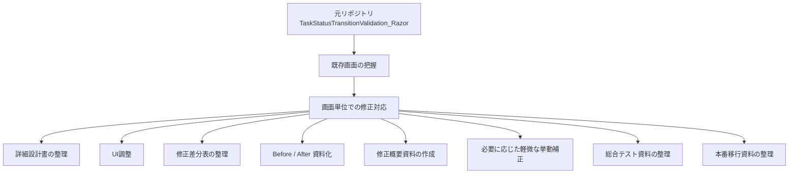

# 画面設計書修正・UI改修サンプル集（Razor Pages）


## 概要

本リポジトリは、既存の Razor Pages 制作物である  
[TaskStatusTransitionValidation_Razor](https://github.com/fewioaghwrao/TaskStatusTransitionValidation_Razor)  
を題材に、**画面設計書修正スキル** および **既存画面のUI改修スキル** を整理・可視化することを目的としたサンプル集です。

既存画面を前提として、文言や業務仕様は原則維持しつつ、主に以下の観点で画面改善を行っています。

- 視認性の向上
- 操作性の向上
- 修正差分の整理
- Before / After による比較
- 画面単位でのCSS調整および影響範囲の確認
- 画面改修内容を詳細設計書として整理
- UI修正に伴う軽微な挙動改善
- 必要に応じた画面ロジックの補助的な見直し

---

## 元リポジトリとの関係

本リポジトリで扱う修正対象は、以下の既存リポジトリに含まれる画面です。

- 元リポジトリ: [TaskStatusTransitionValidation_Razor](https://github.com/fewioaghwrao/TaskStatusTransitionValidation_Razor)

本リポジトリでは、元画面の構成やレイアウトを踏まえたうえで、**既存画面改修の一環としてUI調整・設計資料整理・軽微な操作改善を実施**しています。

---

## 位置づけ



---

## 対象画面

本リポジトリでは、以下の画面を対象に修正内容を整理しています。

| 画面 | 状態 | 主な内容 |
|---|---|---|
| ログイン画面 | 対応済み | 入力欄・ボタン・説明文などの視認性改善、送信時挙動の軽微修正 |
| 案件一覧画面 | 対応済み | ヘッダー、検索条件、一覧表示、ページャのUI調整 |
| タスク一覧画面 | 対応済み | 一覧性、検索条件、状態表示、操作導線、CSV出力導線の改善 |

---

## 対応方針

本リポジトリでの画面修正は、以下の方針で実施しています。

- 文言は原則として業務意図を変えない
- 業務仕様は大きく変更しない
- 既存レイアウトを大きく崩さない
- 配色、文字サイズ、余白、ボタン強調表現を中心に見直す
- 必要に応じて画面単位の専用CSSを追加する
- 共通スタイルへの影響範囲を意識して修正を行う
- 修正内容は差分資料として整理する
- 修正概要に加え、変更内容・対象外・影響範囲・確認観点を詳細設計書として整理する
- UI修正の過程で見つかった軽微な操作上の違和感は必要に応じて補正する
- 画面改修に付随して必要となる軽微な表示制御・補助的な処理改善は必要に応じて取り込む

---

## CSS差分適用と影響範囲確認

本リポジトリでは、単に見た目を差し替えるのではなく、既存画面を前提とした安全な差分反映 を意識してUI改修を行っています。
そのため、各画面の修正では 画面単位で閉じるCSS差分 と 共通スタイルへ影響しうる差分 を切り分けながら進めています。

### 基本的な考え方

- 既存の業務仕様や画面遷移は原則維持する
- レイアウト全体を作り直すのではなく、必要最小限の差分で見やすさ・使いやすさを改善する
- 画面固有の調整は、可能な限り画面専用CSSで吸収する
- 入力欄、ボタン、バッジ、メッセージ、モーダル、ページャなど、他画面でも使われうる表現は共通スタイル影響を意識して扱う
- Before / After 比較だけでなく、影響範囲・確認観点・関連画面確認まで整理する

### 共通CSSと画面専用CSSの切り分け

本リポジトリでは、修正対象を以下のように切り分けています。

**画面専用CSSで閉じるもの**

- 画面タイトル、説明文、補足文
- 画面ごとのレイアウト調整
- 一覧カードや画面固有コンテナ
- 画面ごとの余白、整列、視線誘導の調整

**共通影響を意識して扱うもの**

- 入力欄
- ボタン
- セレクトボックス
- バッジ
- メッセージ表示
- モーダル
- テーブル
- ページャ
- レスポンシブ表示

この切り分けにより、画面単位の改善を行いながら、他画面への不要な波及を抑えることを狙っています。

### 影響範囲確認の進め方

影響範囲確認は、主に次の流れで実施しています。

1. 修正対象画面で Before / After を確認
2. 修正箇所が画面専用か共通表現かを整理
3. 共通影響の可能性がある場合は関連画面を確認
4. 初期表示、入力／操作、画面遷移、異常系表示などを横断的に確認
5. 必要に応じて軽微な表示制御や補助処理を見直す

### 3画面で意識した確認対象

本リポジトリでは、以下のような関連を意識して確認しています。

**ログイン画面**

- 入力欄
- ボタン
- エラーメッセージ
- 補足文
- 共通フォーム表現への波及

**案件一覧画面**

- 検索条件エリア
- 件数切替
- 一覧カード
- ページャ
- リンク表現
- 共通入力／ボタン／テキスト色への波及

**タスク一覧画面**

- 操作ボタン群
- サマリー表示
- 絞り込みフォーム
- 一覧テーブル
- 状態バッジ
- モバイル表示
- CSV出力ダイアログ
- 共通CSS / JS 影響

### この節で示したいこと

このリポジトリで示したいのは、単なるCSS適用経験ではなく、以下のような観点です。

- 既存画面を前提とした最小差分での改修
- 共通CSSと画面専用CSSの切り分け意識
- Before / After による改善意図の説明
- 代表画面から関連画面へ広げる横断確認
- UI修正に伴う軽微な挙動補正や補助処理整理
- 影響範囲確認を含めた実務寄りの改修整理

---

## 対応内容の例

画面ごとに、主に以下のような観点で修正を行っています。

- 画面タイトル、説明文の見やすさ改善
- 入力欄やセレクトボックスの視認性向上
- 主操作ボタンと補助操作ボタンの見分けやすさ改善
- 一覧行の区切り、補足情報、状態表示の見やすさ向上
- ページャや注釈文の余白・配色調整
- Before / After による画面比較資料の整理
- 影響範囲、確認項目の整理
- 送信中表示やモーダル表示など、UIに付随する軽微な挙動の見直し
- 画面要件に応じた検索条件、件数表示、出力導線の整理
- 改修内容を詳細設計書として明文化し、テスト・移行資料につながる形で整理

---

## 現在の対応状況

### 1. ログイン画面

ログイン画面では、既存のログイン機能や文言を維持したまま、主に **視認性** と **操作性** の改善を目的として修正を行いました。

主な対応内容:

- 画面キャッチ、タイトル、説明文の整理
- 入力欄・ラベル・エラーメッセージの視認性改善
- パスワード表示切替ボタンの配置調整
- ログインボタンの強調表現追加
- 注意書き、バージョン表記の整理
- 修正差分表、観点別チェック欄、影響範囲整理の作成
- バリデーション未通過時でも送信中表示に見えてしまう挙動の補正
- 変更内容・実装方針・対象外・確認観点を詳細設計書として整理

ログイン画面は、大幅なレイアウト変更ではなく、既存画面の印象を保ったまま見やすさ・使いやすさを底上げする方向で対応しています。

### 2. 案件一覧画面

案件一覧画面では、既存UIの見直しの一環として CSS を調整し、ヘッダー部、検索条件エリア、案件一覧表示部を中心に **視認性** と **操作性** の向上を図りました。

主な対応内容:

- 画面タイトル、サブタイトルの見やすさを改善
- 検索入力欄、件数切替、検索ボタン、クリアボタンの視認性を調整
- 一覧行の背景色・余白・補足情報の文字色を見直し、案件ごとの区切りを明確化
- 主操作ボタンを強調し、補助操作との見分けがつきやすいよう調整
- ページャや注釈文の余白・配色を見直し、全体の読みやすさを改善
- 変更対象要素、実装方針、影響範囲、対象外を詳細設計書として整理

### 3. タスク一覧画面

タスク一覧画面では、既存のタスク管理画面をベースに、一覧性・操作導線・状態把握のしやすさを高めることを目的として、**UI改善** と **軽微な画面ロジック補助** を含む修正を行いました。

主な対応内容:

- 戻るリンク、機能識別バッジ、ログインユーザー表示を追加し、画面文脈を把握しやすく改善
- 案件名を含む画面タイトル、説明文を追加し、対象画面の意味を明確化
- タスク作成、案件アーカイブ、再読込、CSV出力などの操作導線をヘッダーに整理
- 読み込み中表示、成功メッセージ、エラーメッセージのUIを追加し、操作結果を把握しやすく改善
- 期限切れ件数、近日期限件数、状態別件数のサマリー表示を追加
- キーワード、状態、優先度、期限、表示件数による絞り込みフォームを整理
- 一覧表示をテーブル形式で見直し、状態・優先度を色付きバッジで可視化
- モバイル向けにカード一覧表示を追加し、小画面での可読性を改善
- 上下ページャ、表示範囲表示、注記を追加し、一覧操作を補助
- CSV出力ダイアログを追加し、絞り込み後全件を出力できるよう調整
- UI改修に伴い、絞り込み・集計・ページング・CSV出力・状態遷移制御に関する軽微な補助処理を整理
- UI変更と補助処理整理の内容を詳細設計書として整理

タスク一覧画面は、単なる配色変更にとどまらず、既存UIの改善と操作性向上を主軸にしつつ、画面利用を支える軽微な補助処理も含めて整理したサンプルとしています。

---

## テスト・確認資料

本リポジトリでは、画面修正後の見た目確認だけでなく、各画面ごとに  
詳細設計書、修正概要、修正差分表、総合テスト計画書、確認観点一覧、総合テストケース、実施結果 を整理しています。  
あわせて、各画面について **本番移行手順書、差分資材一覧、反映後確認チェックリスト、切り戻し手順書** も整理しています。

主に以下の観点で確認を実施しています。

- 初期表示
- 入力／操作
- 画面遷移
- 条件分岐
- 権限制御
- 異常系表示
- 件数表示、検索、ページングなどの画面機能確認
- 共通CSS / JS 影響確認
- 関連画面への波及確認

これにより、単なるUI差し替えではなく、  
**詳細設計書による改修内容整理から、確認観点の明確化、実施結果の記録、本番移行準備まで含めた一連の対応** を行っています。

---

## 資料構成

```text
docs/
├─ login/
│  ├─ images/
│  │  ├─ before-login.png
│  │  └─ after-login.png
│  ├─ test/
│  │  ├─ ログイン画面_総合テスト計画書.md
│  │  ├─ ログイン画面_確認観点一覧.tsv
│  │  ├─ ログイン画面_総合テストケース.tsv
│  │  └─ ログイン画面_実施結果.md
│  ├─ release/
│  │  ├─ ログイン画面_本番移行手順書.md
│  │  ├─ ログイン画面_差分資材一覧.tsv
│  │  ├─ ログイン画面_反映後確認チェックリスト.tsv
│  │  └─ ログイン画面_切り戻し手順書.md
│  ├─ ログイン画面_詳細設計書.md
│  ├─ ログイン画面_修正概要.md
│  ├─ ログイン画面_修正差分表.xlsx
│  ├─ ログイン画面_CSS差分適用と影響範囲確認メモ.md
│  └─ ログイン画面_BeforeAfter差分ポイント.md
├─ projects/
│  ├─ images/
│  │  ├─ before-projects.png
│  │  └─ after-projects.png
│  ├─ projects-list/
│  │  ├─ test/
│  │  │  ├─ 案件一覧画面_総合テスト計画書.md
│  │  │  ├─ 案件一覧画面_確認観点一覧.tsv
│  │  │  ├─ 案件一覧画面_総合テストケース.tsv
│  │  │  └─ 案件一覧画面_実施結果.md
│  │  └─ release/
│  │     ├─ 案件一覧画面_本番移行手順書.md
│  │     ├─ 案件一覧画面_差分資材一覧.tsv
│  │     ├─ 案件一覧画面_反映後確認チェックリスト.tsv
│  │     └─ 案件一覧画面_切り戻し手順書.md
│  ├─ 案件一覧画面_詳細設計書.md
│  ├─ 案件一覧画面_修正概要.md
│  ├─ 案件一覧画面_修正差分表.xlsx
│  ├─ 案件一覧画面_CSS差分適用と影響範囲確認メモ.md
│  └─ 案件一覧画面_BeforeAfter差分ポイント.md
├─ tasks/
│  ├─ images/
│  │  ├─ before-tasks.png
│  │  └─ after-tasks.png
│  ├─ task-list/
│  │  ├─ test/
│  │  │  ├─ タスク一覧画面_総合テスト計画書.md
│  │  │  ├─ タスク一覧画面_確認観点一覧.tsv
│  │  │  ├─ タスク一覧画面_総合テストケース.tsv
│  │  │  └─ タスク一覧画面_実施結果.md
│  │  └─ release/
│  │     ├─ タスク一覧画面_本番移行手順書.md
│  │     ├─ タスク一覧画面_差分資材一覧.tsv
│  │     ├─ タスク一覧画面_反映後確認チェックリスト.tsv
│  │     └─ タスク一覧画面_切り戻し手順書.md
│  ├─ タスク一覧画面_詳細設計書.md
│  ├─ タスク一覧画面_修正概要.md
│  ├─ タスク一覧画面_修正差分表.xlsx
│  ├─ タスク一覧画面_CSS差分適用と影響範囲確認メモ.md
│  └─ タスク一覧画面_BeforeAfter差分ポイント.md
└─ common/
   ├─ CSS改修_影響範囲確認一覧.tsv
   ├─ CSS改修_影響範囲確認一覧_案件一覧画面.tsv
   └─ CSS改修_影響範囲確認一覧_タスク一覧画面.tsv
```

本リポジトリでは、**ログイン画面・案件一覧画面・タスク一覧画面** について、詳細設計書、修正概要、テスト資料、本番移行資料に加え、CSS差分適用と影響範囲確認メモ、Before / After差分ポイント整理資料 まで収録しています。

---

## 画面別資料

### ログイン画面

- 詳細設計書: `docs/login/ログイン画面_詳細設計書.md`
- 修正概要: `docs/login/ログイン画面_修正概要.md`
- 修正差分表: `docs/login/ログイン画面_修正差分表.xlsx`
- CSS差分適用と影響範囲確認メモ: `docs/login/ログイン画面_CSS差分適用と影響範囲確認メモ.md`
- Before / After差分ポイント: `docs/login/ログイン画面_BeforeAfter差分ポイント.md`
- 総合テスト計画: `docs/login/test/ログイン画面_総合テスト計画書.md`
- 確認観点一覧: `docs/login/test/ログイン画面_確認観点一覧.tsv`
- 総合テストケース: `docs/login/test/ログイン画面_総合テストケース.tsv`
- 実施結果: `docs/login/test/ログイン画面_実施結果.md`
- Before画像: `docs/login/images/before-login.png`
- After画像: `docs/login/images/after-login.png`
- 本番移行手順書: `docs/login/release/ログイン画面_本番移行手順書.md`
- 差分資材一覧: `docs/login/release/ログイン画面_差分資材一覧.tsv`
- 反映後確認チェックリスト: `docs/login/release/ログイン画面_反映後確認チェックリスト.tsv`
- 切り戻し手順書: `docs/login/release/ログイン画面_切り戻し手順書.md`

### 案件一覧画面

- 詳細設計書: `docs/projects/案件一覧画面_詳細設計書.md`
- 修正概要: `docs/projects/案件一覧画面_修正概要.md`
- 修正差分表: `docs/projects/案件一覧画面_修正差分表.xlsx`
- CSS差分適用と影響範囲確認メモ: `docs/projects/案件一覧画面_CSS差分適用と影響範囲確認メモ.md`
- Before / After差分ポイント: `docs/projects/案件一覧画面_BeforeAfter差分ポイント.md`
- 総合テスト計画: `docs/projects/projects-list/test/案件一覧画面_総合テスト計画書.md`
- 確認観点一覧: `docs/projects/projects-list/test/案件一覧画面_確認観点一覧.tsv`
- 総合テストケース: `docs/projects/projects-list/test/案件一覧画面_総合テストケース.tsv`
- 実施結果: `docs/projects/projects-list/test/案件一覧画面_実施結果.md`
- Before画像: `docs/projects/images/before-projects.png`
- After画像: `docs/projects/images/after-projects.png`
- 本番移行手順書: `docs/projects/projects-list/release/案件一覧画面_本番移行手順書.md`
- 差分資材一覧: `docs/projects/projects-list/release/案件一覧画面_差分資材一覧.tsv`
- 反映後確認チェックリスト: `docs/projects/projects-list/release/案件一覧画面_反映後確認チェックリスト.tsv`
- 切り戻し手順書: `docs/projects/projects-list/release/案件一覧画面_切り戻し手順書.md`

### タスク一覧画面

- 詳細設計書: `docs/tasks/タスク一覧画面_詳細設計書.md`
- 修正概要: `docs/tasks/タスク一覧画面_修正概要.md`
- 修正差分表: `docs/tasks/タスク一覧画面_修正差分表.xlsx`
- CSS差分適用と影響範囲確認メモ: `docs/tasks/タスク一覧画面_CSS差分適用と影響範囲確認メモ.md`
- Before / After差分ポイント: `docs/tasks/タスク一覧画面_BeforeAfter差分ポイント.md`
- 総合テスト計画: `docs/tasks/task-list/test/タスク一覧画面_総合テスト計画書.md`
- 確認観点一覧: `docs/tasks/task-list/test/タスク一覧画面_確認観点一覧.tsv`
- 総合テストケース: `docs/tasks/task-list/test/タスク一覧画面_総合テストケース.tsv`
- 実施結果: `docs/tasks/task-list/test/タスク一覧画面_実施結果.md`
- Before画像: `docs/tasks/images/before-tasks.png`
- After画像: `docs/tasks/images/after-tasks.png`
- 本番移行手順書: `docs/tasks/task-list/release/タスク一覧画面_本番移行手順書.md`
- 差分資材一覧: `docs/tasks/task-list/release/タスク一覧画面_差分資材一覧.tsv`
- 反映後確認チェックリスト: `docs/tasks/task-list/release/タスク一覧画面_反映後確認チェックリスト.tsv`
- 切り戻し手順書: `docs/tasks/task-list/release/タスク一覧画面_切り戻し手順書.md`

---

## 画面比較

### ログイン画面

**Before**


**After**


### 案件一覧画面

**Before**


**After**


### タスク一覧画面

**Before**


**After**


---

## このリポジトリで示したいこと

本リポジトリでは、単なる見た目調整ではなく、以下の観点を重視しています。

- 既存画面を前提とした改修対応
- 画面設計書修正の観点整理
- 詳細設計書による改修内容の明確化
- 修正差分と影響範囲の明確化
- 観点別チェック欄による確認整理
- 共通CSSと画面専用CSSの切り分け
- Before / After による改善内容の可視化
- UI修正に付随する軽微な挙動改善
- 必要に応じた画面ロジックの補助的な整理
- 総合テスト観点の整理と実施結果の記録
- 本番移行資料の整理によるリリース準備の明確化
- 影響範囲確認を含めた実務寄りの改修整理

これにより、**既存画面の改修経験** と **画面修正資料の整理力** の両方を示せる構成を目指しています。

---

## 今後の拡張候補

- 画面ごとの修正観点の比較整理
- 画面単位CSSの整理方針の明文化
- テスト観点の横断整理
- 必要に応じたREADMEの更新

---

## 補足

本リポジトリは、既存リポジトリ  
[TaskStatusTransitionValidation_Razor](https://github.com/fewioaghwrao/TaskStatusTransitionValidation_Razor)  
を題材として、画面修正・設計資料整理の観点をまとめたものです。

業務仕様や文言の大幅な変更を主目的とするものではなく、**既存UIを前提とした改善・整理・差分管理・確認資料整備** に重点を置いています。