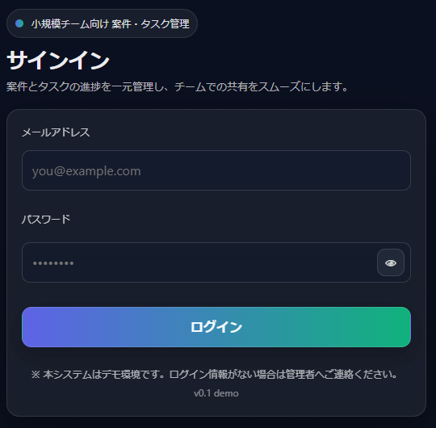

# ログイン画面_詳細設計書

## 1. 文書情報

| 項目 | 内容 |
|---|---|
| 文書名 | ログイン画面_詳細設計書 |
| 対象画面 | ログイン画面 |
| 画面ID | PJ-INDEX-002（仮） |
| 対象機能 | ログイン画面表示・認証入力機能 |
| 修正区分 | 画面設計書修正 / UI改修 / 軽微な挙動補正 |
| 関連資料 | ログイン画面_修正概要.md / ログイン画面_修正差分表.xlsx / 総合テスト資料 / 本番移行資料 |

---

## 2. 改修概要

本改修は、既存のログイン画面を対象として、業務仕様および認証機能そのものは変更せず、主に **視認性の向上**、**操作性の向上**、**修正差分の明確化** を目的として実施する。

対象画面は既存レイアウトを大きく崩さないことを前提とし、以下の観点で見直しを行う。

- 画面上部のキャッチ、タイトル、説明文の整理
- 入力欄、ラベル、エラーメッセージの視認性向上
- パスワード表示切替操作の分かりやすさ改善
- 主操作ボタンであるログインボタンの強調
- 補足情報の整理
- 送信時表示に関する軽微な挙動不整合の補正

なお、本改修は **見た目および画面操作補助の改善** を主目的とし、認証処理、権限制御、DBアクセス、入力チェック仕様の根本変更は行わない。

---

## 3. 改修方針

本改修は、以下の方針に従って実施する。

- 既存の業務仕様、認証仕様、画面遷移は維持する
- 文言は原則として業務意図を変えない
- 既存レイアウトを大きく変更せず、見やすさ・使いやすさを改善する
- 変更差分は画面単位で整理し、必要に応じて画面専用スタイルで吸収する
- 共通スタイルへの影響は極力抑え、他画面への波及を最小化する
- UI変更に付随して発見された軽微な挙動不整合は、画面改修の範囲内で補正する
- 実装内容は総合テストおよび本番移行資料と整合するよう整理する

---

## 4. 対象画面

### 4.1 画面名
- ログイン画面

### 4.2 画面の役割
- 利用者がメールアドレスおよびパスワードを入力し、認証を行うための起点画面

### 4.3 画面表示タイミング
- 未認証状態で対象システムへアクセスした際に表示される

### 4.4 主な利用機能
- メールアドレス入力
- パスワード入力
- パスワード表示／非表示切替
- ログイン実行
- エラーメッセージ表示
- 認証成功後の画面遷移

---

## 5. 修正対象要素

本改修における主な修正対象要素は以下のとおりとする。

| No | 対象区分 | 対象要素 | 主な修正内容 |
|---|---|---|---|
| 1 | ヘッダー部 | 画面キャッチ | バッジ形式表示、視認性向上 |
| 2 | ヘッダー部 | 画面タイトル | 見出し強調、余白調整 |
| 3 | ヘッダー部 | 説明文 | 位置・文字色・可読性調整 |
| 4 | 入力部 | メールアドレス入力欄 | ラベル整理、背景・枠線・フォーカス調整 |
| 5 | 入力部 | パスワード入力欄 | ラベル整理、背景・枠線・フォーカス調整 |
| 6 | 入力補助 | パスワード表示切替ボタン | 配置調整、アイコン・aria-label更新 |
| 7 | エラー表示 | バリデーションメッセージ | 入力欄直下表示、判別性向上 |
| 8 | 主操作 | ログインボタン | 強調表現追加、二重送信防止 |
| 9 | 補足表示 | 注記・補足文言 | 主情報を妨げない整理 |
| 10 | 補足表示 | バージョン表記 | 優先度を下げた見せ方へ調整 |
| 11 | 挙動 | 送信中表示 | バリデーション通過時のみ切替 |

---

## 6. 変更内容一覧

| No | 対象箇所 | 変更前 | 変更後 | 変更区分 | 備考 |
|---|---|---|---|---|---|
| 1 | 画面上部情報 | 情報量が少なく用途が伝わりにくい | バッジ・タイトル・説明文を整理し画面意図を明確化 | 表示変更 | 機能変更なし |
| 2 | 入力欄 | 背景や境界が弱くダーク背景上で判別しづらい | 背景色・枠線・角丸・余白を調整し入力領域を明確化 | 表示変更 | メールアドレス/パスワード共通 |
| 3 | フォーカス表示 | 操作中の視認性が弱い | フォーカス時の枠線・影を追加し操作対象を明確化 | 表示変更 | 入力支援 |
| 4 | エラー表示 | 視線誘導が弱い | 入力欄直下に表示し誤入力箇所を分かりやすくする | 表示変更 | バリデーション仕様自体は変更なし |
| 5 | パスワード補助 | 表示切替の存在が分かりづらい | 右端配置とアイコン変更で操作補助を明確化 | 表示変更 / 補助改善 | aria-label更新あり |
| 6 | ログインボタン | 主要操作としての強調が弱い | グラデーション・太字・影付きで主操作を明確化 | 表示変更 | 処理内容変更なし |
| 7 | 送信時ボタン表示 | 入力不備時でも送信中表示になる場合がある | バリデーション通過時のみ送信中表示へ切替 | 挙動補正 | 軽微なUI挙動補正 |
| 8 | 注記・補足情報 | 情報の主従が弱い | 注記を整理しバージョン表記を弱めて表示 | 表示変更 | 業務文言変更なし |

---

## 7. 項目別詳細設計

### 7.1 ヘッダー部

#### 7.1.1 画面キャッチ
- 対象要素：画面上部の補助ラベル
- 目的：対象システムの用途や位置づけを視覚的に補足する
- 変更内容：
  - バッジ形式で表示する
  - 背景色、文字色、余白、角丸を調整し補助情報として認識しやすくする
- 注意点：
  - 主見出しより目立ちすぎないようにする
  - 業務上の名称は変更しない

#### 7.1.2 画面タイトル
- 対象要素：ログイン画面の主見出し
- 目的：画面種別を即時に認識できるようにする
- 変更内容：
  - 見出しサイズを拡大する
  - 文字ウェイトを上げる
  - 前後余白を見直し、バッジ・説明文との関係を整理する
- 注意点：
  - 文言は変更しない
  - 小画面表示時にレイアウト崩れが発生しないこと

#### 7.1.3 説明文
- 対象要素：タイトル直下の補助文
- 目的：利用者に画面用途を補足する
- 変更内容：
  - 主見出し直下へ配置する
  - 可読性を考慮した文字色・行間へ調整する
- 注意点：
  - 長文化しない
  - 主操作の視線導線を妨げない

---

### 7.2 入力欄

#### 7.2.1 メールアドレス入力欄
- 対象要素：メールアドレス入力項目
- 目的：入力項目の判別性および操作性を高める
- 変更内容：
  - ラベルを見やすい位置・文字サイズへ整理する
  - 入力欄の背景色、枠線、角丸を調整する
  - パディングを調整し入力しやすい見た目へ改善する
  - フォーカス時の枠線・影を追加し操作中状態を明確化する
- 注意点：
  - 入力形式チェックや認証処理は変更しない
  - プレースホルダの有無や内容は既存仕様に従う

#### 7.2.2 パスワード入力欄
- 対象要素：パスワード入力項目
- 目的：入力誤りを減らし、操作中の判別性を向上させる
- 変更内容：
  - ラベルを整理し入力欄との関係を明確にする
  - メールアドレス欄と統一感のあるスタイルに調整する
  - フォーカス時の視覚効果を付与する
- 注意点：
  - マスキング仕様は維持する
  - パスワード保存等の仕様変更は行わない

---

### 7.3 エラー表示

#### 7.3.1 バリデーションメッセージ
- 対象要素：入力不備時のメッセージ表示領域
- 目的：誤入力箇所と原因を把握しやすくする
- 変更内容：
  - 入力欄直下に表示する
  - 文字色、余白を調整してエラーとして識別しやすくする
  - 必要に応じて `role="alert"` 等を用いて通知性を補助する
- 注意点：
  - バリデーションルール自体は変更しない
  - エラーメッセージ文言は原則変更しない
  - エラー表示により隣接要素が不自然にずれないこと

#### 7.3.2 認証失敗メッセージ
- 対象要素：ログイン失敗時のメッセージ表示
- 目的：認証失敗を利用者が認識しやすい状態にする
- 変更内容：
  - 既存のエラーメッセージ表示位置・スタイルを見直す
  - 画面全体のトーンに合わせつつ、失敗状態と分かる見せ方にする
- 注意点：
  - 認証失敗時の制御内容は変更しない
  - 再入力操作を妨げないこと

---

### 7.4 パスワード表示切替

#### 7.4.1 表示切替ボタン
- 対象要素：パスワード入力欄右端の切替ボタン
- 目的：入力内容確認をしやすくし、入力ミスを防止する
- 変更内容：
  - 入力欄右端に配置する
  - 表示／非表示状態に応じてアイコンを切り替える
  - `aria-label` を状態に応じて更新する
- 注意点：
  - キーボード操作でも扱えること
  - ボタン押下により入力フォーカスや入力内容が不自然に失われないこと
  - セキュリティ仕様自体は変更しない

---

### 7.5 主操作ボタン

#### 7.5.1 ログインボタン
- 対象要素：ログイン実行ボタン
- 目的：画面上の主操作を視覚的に明確化する
- 変更内容：
  - 背景をグラデーションへ変更する
  - 文字を太字にし、必要に応じて影を追加する
  - ホバー、フォーカス、押下時の見え方を整理する
  - 送信時に一時的に無効化し二重送信を防止する
- 注意点：
  - ボタン押下時の業務処理は変更しない
  - 活性／非活性条件は既存仕様を維持する
  - 見た目強調により周辺要素とのバランスを崩さないこと

#### 7.5.2 送信中表示
- 対象要素：ログインボタン押下後の表示状態
- 目的：送信中であることを利用者に分かりやすく示しつつ、不自然な状態遷移を防ぐ
- 変更内容：
  - バリデーション通過時のみ「ログイン中…」へ切り替える
  - 送信中はボタンを一時的に無効化する
  - 画面再表示時は通常状態へ戻す
- 注意点：
  - バリデーション未通過時は通常表示を維持する
  - 送信失敗時や再表示時に表示状態が残留しないこと

---

### 7.6 補足情報

#### 7.6.1 注記
- 対象要素：デモ環境等の補助説明
- 目的：必要な補足情報を整理し、利用者の誤認を防ぐ
- 変更内容：
  - 主操作領域を妨げない位置へ整理する
  - 色やサイズを調整し補助情報として表示する
- 注意点：
  - 業務上必要な注意文は削除しない
  - 主情報より目立たせない

#### 7.6.2 バージョン表記
- 対象要素：画面下部等の補足表示
- 目的：必要情報を維持しつつ、主情報との優先度差を明確化する
- 変更内容：
  - 文字サイズ、色、配置を調整し補足情報として弱めに表示する
- 注意点：
  - バージョン情報そのものは変更しない

---

## 8. 挙動補正設計

### 8.1 補正対象
- ログインボタン押下時の送信中表示制御

### 8.2 補正前の課題
- 入力不備やバリデーション未通過時でも送信中表示へ切り替わる場合がある
- 利用者視点では、実際には送信されていないにもかかわらず処理中に見える
- 再表示後の状態が不自然に見える可能性がある

### 8.3 補正内容
- バリデーション結果を確認し、通過時のみ送信中表示へ切り替える
- 未通過時は通常の「ログイン」表示を維持する
- 画面再表示時は通常状態へ戻す

### 8.4 補正範囲
- 画面上の表示制御
- ボタン活性状態制御
- 送信前後の軽微なUI挙動

### 8.5 対象外
- 認証ロジックそのもの
- サーバー側認証結果判定仕様
- バリデーションルール定義

---

## 9. 実装方針

### 9.1 スタイル適用方針
- 画面固有の見た目調整は、可能な限り画面専用スタイルで対応する
- 既存共通スタイルを直接変更する場合は、他画面への影響確認を前提とする
- 主に以下の要素を調整対象とする
  - 文字サイズ
  - 色
  - 背景色
  - 枠線
  - 余白
  - 角丸
  - 影
  - フォーカス時スタイル

### 9.2 HTML構造方針
- 大幅な構造変更は行わない
- 見出し、補助文、注記、入力欄周辺など、意味づけを損なわない範囲で必要最小限の整理を行う
- アクセシビリティを考慮し、ラベル・ボタン・通知領域の属性を必要に応じて見直す

### 9.3 JavaScript / 画面挙動方針
- パスワード表示切替
- 送信中表示切替
- ボタン活性制御

上記について、既存仕様を大きく変えない範囲で画面操作補助として整理する。

---

## 10. 共通部品・影響範囲

### 10.1 直接影響
- ログイン画面の表示
- メールアドレス入力
- パスワード入力
- パスワード表示切替
- ログインボタン押下時の表示
- 認証失敗時のエラーメッセージ表示

### 10.2 間接影響
- 共通入力スタイルを利用している場合、他画面の入力欄見た目に影響する可能性がある
- 共通ボタンスタイルを直接変更した場合、他画面の主操作ボタンにも影響する可能性がある
- 共通通知スタイルを利用している場合、他画面のメッセージ表示と見え方が変わる可能性がある

### 10.3 影響範囲確認観点
- 他画面で共通クラス利用箇所がないか
- ログイン画面専用スタイルとして分離できているか
- 認証失敗時、バリデーション時、通常時の各表示で崩れがないか
- 小画面表示時にも意図しない折返しやはみ出しがないか

---

## 11. 対象外

本改修における対象外は以下のとおりとする。

- 認証処理そのものの変更
- ユーザー管理仕様の変更
- 権限制御の変更
- DBアクセス処理の変更
- API仕様の変更
- バリデーションルール自体の変更
- エラーメッセージ文言の大幅変更
- 画面遷移先の変更
- セッション管理方式の変更

---

## 12. 確認観点

### 12.1 表示確認
- ログイン画面が崩れず表示されること
- 画面キャッチ、タイトル、説明文が意図した位置に表示されること
- 注記およびバージョン表記が主情報を妨げないこと
- ダーク背景上でも入力欄やボタンが判別しやすいこと

### 12.2 入力確認
- メールアドレス入力欄へ正常に入力できること
- パスワード入力欄へ正常に入力できること
- フォーカス時の見た目が正しく反映されること

### 12.3 エラー表示確認
- 未入力時や不正入力時にエラーメッセージが適切に表示されること
- エラーメッセージが入力欄直下に表示されること
- エラー表示時にレイアウト崩れが発生しないこと

### 12.4 補助操作確認
- パスワード表示切替が正常に機能すること
- 表示／非表示に応じてアイコンと aria-label が更新されること

### 12.5 主操作確認
- ログインボタン押下で認証処理が開始されること
- 認証成功時に案件一覧画面へ遷移すること
- 認証失敗時にエラーメッセージが表示されること
- 送信時に二重送信防止が機能すること

### 12.6 挙動補正確認
- バリデーション未通過時に「ログイン中…」へ切り替わらないこと
- バリデーション通過時のみ送信中表示へ切り替わること
- 画面再表示後にボタン状態が不自然に残らないこと

---

## 13. Before / After

### Before

### After

---

## 14. 関連資料

- 修正概要: `docs/login/ログイン画面_修正概要.md`
- 修正差分表: `docs/login/ログイン画面_修正差分表.xlsx`
- 総合テスト計画書: `docs/login/test/ログイン画面_総合テスト計画書.md`
- 確認観点一覧: `docs/login/test/ログイン画面_確認観点一覧.tsv`
- 総合テストケース: `docs/login/test/ログイン画面_総合テストケース.tsv`
- 実施結果: `docs/login/test/ログイン画面_実施結果.md`
- 本番移行手順書: `docs/login/release/ログイン画面_本番移行手順書.md`
- 差分資材一覧: `docs/login/release/ログイン画面_差分資材一覧.tsv`
- 反映後確認チェックリスト: `docs/login/release/ログイン画面_反映後確認チェックリスト.tsv`
- 切り戻し手順書: `docs/login/release/ログイン画面_切り戻し手順書.md`

---

## 15. 補足

本詳細設計書は、既存ログイン画面の業務仕様を変更することなく、既存UIを前提とした見やすさ・使いやすさの改善、および軽微な表示挙動補正を整理することを目的とする。

設計、実装、総合テスト、本番移行の各資料と整合を取りながら、修正差分と影響範囲を明確にし、既存画面改修案件を想定した資料構成とする。