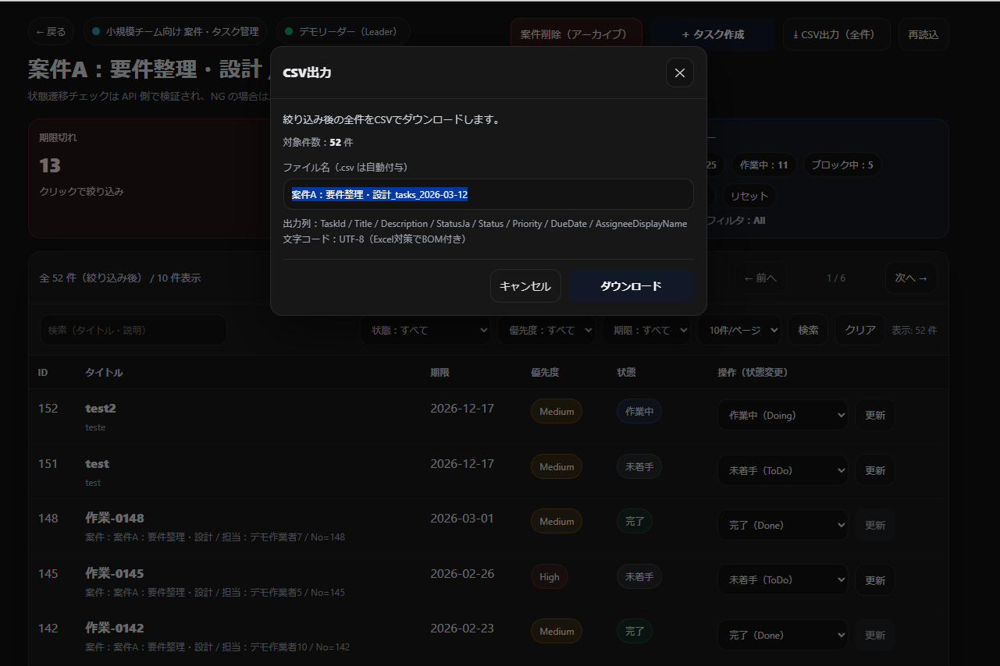
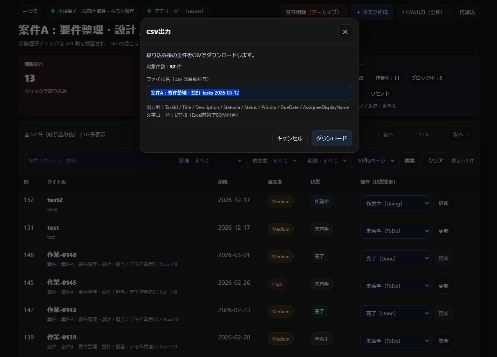

# タスク一覧画面_詳細設計書

## 1. 文書情報

| 項目 | 内容 |
|---|---|
| 文書名 | タスク一覧画面_詳細設計書 |
| 対象画面 | タスク一覧画面 |
| 画面ID | TASK-LIST-001（仮） |
| 対象URL例 | `/Projects/{projectId}/Tasks` |
| 対象機能 | タスク一覧表示、検索・絞り込み、状態変更、ページング、CSV出力、レスポンシブ表示 |
| 修正区分 | 画面設計書修正 / UI改修 / 軽微な補助処理整理 |
| 関連資料 | タスク一覧画面_修正概要.md / タスク一覧画面_修正差分表.xlsx / 総合テスト資料 / 本番移行資料 |

---

## 2. 改修概要

本改修は、既存のタスク一覧画面を対象として、既存の業務意図および主要な画面利用目的は維持したまま、主に **視認性の向上**、**操作性の向上**、**画面文脈の明確化**、**修正差分の整理** を目的として実施する。

対象画面は、既存の一覧画面構成を大きく崩さないことを前提とし、以下の観点で見直しを行う。

- 対象案件、画面用途、ログインユーザー情報を把握しやすいヘッダー構成への改善
- 主操作および補助操作の導線整理
- ローディング、成功、失敗の状態表示追加
- 状況把握を支援するサマリー領域の追加
- 検索・絞り込み条件エリアの整理
- タスク一覧の視認性向上
- 状態や優先度の視覚的な識別性向上
- 一覧上での状態変更操作の補助
- ページャ、表示件数、表示範囲の整理
- モバイル向けカード表示の追加
- CSV出力導線の追加と補助処理の整理

なお、本改修は **既存画面のUI改善および画面操作を支える補助的な処理整理** を主目的とし、根本的な業務ルールの変更、状態遷移ルール自体の変更、権限制御仕様の変更は行わない。

---

## 3. 改修方針

本改修は、以下の方針に従って実施する。

- 既存の業務意図、文言、主要な利用目的は原則維持する
- 既存の一覧画面構成を大きく変更しない
- 画面上部で対象案件、利用者、用途を把握しやすくする
- 一覧表示前に状況把握ができるよう、件数サマリーを追加する
- 検索・絞り込み・表示件数・ページャの位置関係を整理し、操作導線を分かりやすくする
- 状態や優先度は視認性を重視したバッジ表示で補助する
- 一覧上での状態変更操作は、サーバー側業務ルールと矛盾しないよう画面側で補助制御を行う
- 小画面では可読性を重視し、カード表示へ切り替える
- 共通スタイルへの影響は極力抑え、画面専用CSSで吸収可能な部分は専用化する
- 追加する処理は、画面改善を成立させるための補助的な範囲に留める
- 実装内容は総合テスト資料および本番移行資料と整合するよう整理する

---

## 4. 対象画面

### 4.1 画面名
- タスク一覧画面

### 4.2 画面の役割
- 案件配下のタスクを一覧表示し、利用者が状態確認、検索、絞り込み、ページ移動、状態更新、CSV出力等を行うための画面

### 4.3 主な利用機能
- 戻るリンク表示
- 画面用途バッジ表示
- ログインユーザー情報表示
- 案件名表示
- 状態遷移説明表示
- タスク作成導線
- 案件削除（アーカイブ）導線
- 再読込導線
- CSV出力導線
- ローディング表示
- 成功・エラーメッセージ表示
- サマリー表示
- キーワード・状態・優先度・期限・表示件数による絞り込み
- 一覧表示
- 状態変更フォーム
- ページング
- モバイル向けカード表示

---

## 5. 修正対象要素

本改修における主な修正対象要素は以下のとおりとする。

| No | 対象区分 | 対象要素 | 主な修正内容 |
|---|---|---|---|
| 1 | ヘッダー部 | 戻るリンク | 案件一覧への戻り導線追加 |
| 2 | ヘッダー部 | 画面識別バッジ | 画面用途の補助表示 |
| 3 | ヘッダー部 | ユーザー表示部 | ログインユーザー名・ロール表示 |
| 4 | ヘッダー部 | 画面タイトル | 案件名を含む見出し整理 |
| 5 | ヘッダー部 | 説明文 | 状態遷移チェックの前提補足 |
| 6 | 操作導線 | 操作ボタン群 | タスク作成、CSV出力、再読込、案件削除の集約 |
| 7 | メッセージ | ローディング表示 | 全画面ローディング追加 |
| 8 | メッセージ | 成功メッセージ | 操作結果通知追加 |
| 9 | メッセージ | エラーメッセージ | 異常時通知追加 |
| 10 | サマリー | 件数サマリー | 期限・状態別件数表示追加 |
| 11 | サマリー | 期限フィルタ表示 | 現在の絞り込み条件補足 |
| 12 | 検索条件 | キーワード入力 | 検索条件フォーム整理 |
| 13 | 検索条件 | 状態絞り込み | 条件指定UI整理 |
| 14 | 検索条件 | 優先度絞り込み | 条件指定UI整理 |
| 15 | 検索条件 | 期限絞り込み | 条件指定UI整理 |
| 16 | 検索条件 | 表示件数切替 | 件数切替UI整理 |
| 17 | 検索条件 | 検索 / クリア | 実行導線整理 |
| 18 | 一覧表示 | テーブルヘッダー | 列見出し整理 |
| 19 | 一覧表示 | タスク行 | 主要情報の視認性改善 |
| 20 | 一覧表示 | タイトルリンク | 詳細画面遷移導線 |
| 21 | 一覧表示 | 説明表示 | 補足表示整理 |
| 22 | 一覧表示 | 優先度バッジ | 色付き表示追加 |
| 23 | 一覧表示 | 状態バッジ | 日本語ラベル付き表示追加 |
| 24 | 一覧表示 | 状態変更フォーム | 行単位更新操作追加・整理 |
| 25 | ページャ | 上下ページャ | 前後移動、ページ数、表示範囲追加 |
| 26 | モバイル | カード表示 | 小画面向けレイアウト追加 |
| 27 | CSV出力 | 出力ダイアログ | 確認、件数表示、ファイル名入力追加 |

---

## 6. 変更内容一覧

| No | 対象箇所 | 変更前 | 変更後 | 変更区分 | 備考 |
|---|---|---|---|---|---|
| 1 | 画面上部 | 案件文脈や利用者情報が把握しづらい | 戻るリンク、識別バッジ、ユーザー表示、案件名入りタイトル、説明文を整理 | 表示変更 | 業務文言は原則維持 |
| 2 | 操作導線 | 操作位置が分散しやすい | タスク作成、CSV出力、再読込、案件削除をヘッダー右側へ集約 | 表示変更 / 導線整理 | 案件削除は確認付き |
| 3 | 状態通知 | 画面操作時の状態把握が弱い | ローディング、成功、エラー表示を追加 | 表示変更 / 補助機能追加 | 処理本体は既存意図に準拠 |
| 4 | 一覧前情報 | 一覧を見る前に状況把握しづらい | 期限別・状態別件数サマリーを追加 | 表示変更 / 補助処理追加 | 集計処理あり |
| 5 | 検索条件 | 条件指定が整理不足 | キーワード、状態、優先度、期限、表示件数をフォーム化して整理 | 表示変更 | 絞り込み処理整理あり |
| 6 | 一覧表示 | 視認性・一覧性が弱い | テーブル見出し、説明、バッジ、操作列を整理 | 表示変更 | 一覧構造改善 |
| 7 | 状態表示 | 状態や優先度の把握がしづらい | 色付きバッジ・日本語ラベル表示を追加 | 表示変更 | 判定自体は既存ルール準拠 |
| 8 | 状態変更 | 画面上での更新補助が弱い | 行ごとに状態変更フォームを配置し、選択肢制御を追加 | 表示変更 / 補助制御追加 | disabled 制御あり |
| 9 | ページング | 現在位置や移動導線が分かりづらい | 上下ページャ、現在ページ、総ページ数、表示範囲を追加 | 表示変更 / 補助処理追加 | ページング処理整理あり |
| 10 | モバイル表示 | 小画面で見づらい | カード表示へ切替し可読性を向上 | 表示変更 | レスポンシブ対応 |
| 11 | CSV出力 | 一覧から自然に出力しづらい | ダイアログ経由で確認、件数表示、ファイル名指定のうえ出力 | 表示変更 / 補助機能追加 | UTF-8 BOM付き |

---

## 7. 項目別詳細設計

### 7.1 ヘッダー部

#### 7.1.1 戻るリンク
- 対象要素：案件一覧へ戻るためのリンク
- 目的：現在表示中のタスク一覧が案件配下画面であることを明確にし、上位画面への導線を分かりやすくする
- 変更内容：
  - 画面上部に案件一覧へ戻るリンクを配置する
  - 他のヘッダー要素より過度に強調せず、補助導線として認識しやすくする
- 注意点：
  - 遷移先は既存仕様に従う
  - 小画面時にも押下しやすい配置とする

#### 7.1.2 画面識別バッジ
- 対象要素：画面用途を補足するバッジ
- 目的：利用者が画面種別を即時に把握できるようにする
- 変更内容：
  - 画面用途を示すラベルをバッジ形式で表示する
  - 背景色、文字色、余白、角丸を調整する
- 注意点：
  - 主見出しより強くしない
  - 補助情報としての位置づけを維持する

#### 7.1.3 ユーザー表示部
- 対象要素：ログインユーザー名およびロール表示
- 目的：現在どの立場で操作しているかを把握しやすくする
- 変更内容：
  - ユーザー名とロールをヘッダー内に表示する
  - 背景、余白、文字サイズを調整し他要素と視覚的に分離する
- 注意点：
  - 表示内容の業務意味は変更しない
  - 画面横幅が狭い場合も崩れないこと

#### 7.1.4 画面タイトル
- 対象要素：案件名を含む主見出し
- 目的：対象案件と画面目的を明確にする
- 変更内容：
  - 案件名を含むタイトルを主見出しとして表示する
  - 文字サイズ、ウェイト、余白を見直す
- 注意点：
  - 案件名の取得仕様は変更しない
  - 長い案件名でも過度に崩れないこと

#### 7.1.5 説明文
- 対象要素：状態遷移チェック等に関する補助説明
- 目的：利用者が画面利用前提を理解しやすくする
- 変更内容：
  - 画面タイトル直下に説明文を配置する
  - 行間や文字色を調整して可読性を確保する
- 注意点：
  - 業務意図を変える説明追加は行わない
  - 長文化しすぎない

---

### 7.2 操作導線エリア

#### 7.2.1 操作ボタン群
- 対象要素：案件削除（アーカイブ）、タスク作成、CSV出力、再読込ボタン
- 目的：利用頻度の高い操作を一か所に集約し、操作位置を把握しやすくする
- 変更内容：
  - ヘッダー右側に操作ボタン群を配置する
  - 主操作と補助操作の見た目に優先度差を持たせる
- 注意点：
  - 各ボタンの業務処理そのものは既存意図に従う
  - 小画面時は折返しや縦積みも考慮する

#### 7.2.2 案件削除（アーカイブ）
- 対象要素：案件削除ボタン
- 目的：破壊的操作に対する誤操作を抑止する
- 変更内容：
  - 確認ダイアログを表示したうえで実行する
  - 他ボタンと見分けやすいスタイルにする
- 注意点：
  - 削除条件や業務処理内容は変更しない
  - 誤押下しやすい配置にしない

#### 7.2.3 タスク作成
- 対象要素：タスク作成導線
- 目的：一覧から新規登録へ自然につなげる
- 変更内容：
  - 主操作として識別しやすいスタイルにする
- 注意点：
  - 遷移先や登録仕様は変更しない

#### 7.2.4 CSV出力
- 対象要素：CSV出力ボタン
- 目的：絞り込み後データの出力導線を明確にする
- 変更内容：
  - ダイアログ起動ボタンとして配置する
- 注意点：
  - 出力そのものは確認ダイアログ経由とする

#### 7.2.5 再読込
- 対象要素：再読込ボタン
- 目的：一覧再取得の導線を分かりやすくする
- 変更内容：
  - 補助操作として配置する
- 注意点：
  - 再取得処理仕様は変更しない

---

### 7.3 ローディング・メッセージ表示

#### 7.3.1 ローディング表示
- 対象要素：全画面ローディング表示
- 目的：読込中であることを利用者が把握できるようにする
- 変更内容：
  - 読込中に全画面オーバーレイまたは同等のローディングUIを表示する
- 注意点：
  - 読込完了後に表示が残留しないこと
  - 二重操作を誘発しないこと

#### 7.3.2 成功メッセージ
- 対象要素：更新成功時等の通知表示
- 目的：成功状態を利用者に明示する
- 変更内容：
  - 成功時に視認しやすいメッセージを表示する
- 注意点：
  - 成功条件は既存処理結果に従う
  - 長時間残り続けないこと

#### 7.3.3 エラーメッセージ
- 対象要素：更新失敗時等の通知表示
- 目的：異常状態を利用者に明示する
- 変更内容：
  - エラー時に目立つメッセージを表示する
- 注意点：
  - サーバー側例外内容を過度に露出しない
  - 再操作の妨げにならないこと

---

### 7.4 サマリー表示

#### 7.4.1 件数サマリー
- 対象要素：期限切れ、近日期限、未着手、作業中、ブロック中、完了件数の表示領域
- 目的：一覧閲覧前に全体状況を把握できるようにする
- 変更内容：
  - 状態別・期限別件数をまとめたサマリー領域を表示する
  - 各指標を視認しやすいカードまたはバッジ形式で整理する
- 注意点：
  - 件数算出条件は定義どおり統一する
  - フィルタ条件との整合に注意する

#### 7.4.2 期限フィルタ表示
- 対象要素：現在の期限フィルタ補足表示
- 目的：一覧がどの条件で絞り込まれているか分かるようにする
- 変更内容：
  - サマリー付近に現在の期限条件を表示する
- 注意点：
  - 条件未指定時の表示ルールを統一する

---

### 7.5 検索・絞り込み条件エリア

#### 7.5.1 キーワード入力
- 対象要素：キーワード検索入力欄
- 目的：タイトルや説明等を対象に検索しやすくする
- 変更内容：
  - 入力欄の背景、枠線、余白を整理する
  - 他条件との並びを整理し検索起点として分かりやすくする
- 注意点：
  - 検索対象項目の仕様は変更しない
  - プレースホルダ文言は既存意図に従う

#### 7.5.2 状態絞り込み
- 対象要素：状態選択UI
- 目的：状態単位で対象タスクを絞り込みやすくする
- 変更内容：
  - 状態選択項目を分かりやすく整理する
- 注意点：
  - 状態値定義は変更しない

#### 7.5.3 優先度絞り込み
- 対象要素：優先度選択UI
- 目的：優先度単位で対象タスクを絞り込みやすくする
- 変更内容：
  - 優先度選択項目を整理する
- 注意点：
  - 優先度定義は変更しない

#### 7.5.4 期限絞り込み
- 対象要素：期限条件選択UI
- 目的：期限状態に応じた絞り込みを行いやすくする
- 変更内容：
  - 期限条件選択をフォーム内で整理する
- 注意点：
  - 条件解釈はサマリー表示と整合させる

#### 7.5.5 表示件数切替
- 対象要素：件数切替UI
- 目的：一度に表示する件数を調整しやすくする
- 変更内容：
  - 他条件と同一フォーム内に配置し、一覧操作の一貫性を高める
- 注意点：
  - 不正値は正規化する
  - 切替後のページ位置制御に注意する

#### 7.5.6 検索 / 条件クリア
- 対象要素：検索実行ボタン、条件クリアボタン
- 目的：条件適用と初期化を明確に分ける
- 変更内容：
  - 主操作と補助操作の見た目に差を持たせる
- 注意点：
  - 条件クリア後の初期状態定義を統一する

---

### 7.6 一覧表示部

#### 7.6.1 テーブルヘッダー
- 対象要素：ID、タイトル、説明、期限、優先度、状態、操作の列見出し
- 目的：一覧項目の意味を明確にする
- 変更内容：
  - 列見出しを整理し視認性を高める
- 注意点：
  - 列構成は業務意図に沿って維持する

#### 7.6.2 タスク行
- 対象要素：各タスクの表示行
- 目的：一件ごとの情報を読みやすくする
- 変更内容：
  - 行ごとの余白、区切り、整列を整理する
- 注意点：
  - 行高が過度に増えないこと
  - 空データ時表示も考慮する

#### 7.6.3 タイトルリンク
- 対象要素：タスク詳細への遷移リンク
- 目的：一覧から詳細確認へ自然に遷移できるようにする
- 変更内容：
  - リンクとして判別しやすいスタイルを適用する
- 注意点：
  - 遷移先仕様は変更しない

#### 7.6.4 説明表示
- 対象要素：タスク説明文の補足表示
- 目的：タイトルだけでは分からない内容を補助する
- 変更内容：
  - 補足文字として読みやすいレイアウトにする
- 注意点：
  - 長文時の折返しや省略表示方針に注意する

#### 7.6.5 優先度バッジ
- 対象要素：優先度表示
- 目的：優先度の高低を視覚的に把握しやすくする
- 変更内容：
  - 色付きバッジ形式で表示する
- 注意点：
  - 色だけに依存しすぎず、文言でも区別できること

#### 7.6.6 状態バッジ
- 対象要素：状態表示
- 目的：状態を日本語で直感的に認識できるようにする
- 変更内容：
  - 日本語ラベル付きの色付きバッジで表示する
- 注意点：
  - 状態値と表示ラベルの対応を固定する

---

### 7.7 状態変更操作

#### 7.7.1 状態変更フォーム
- 対象要素：一覧行ごとの状態変更UI
- 目的：一覧から直接状態更新できるようにする
- 変更内容：
  - 各行に状態変更フォームを配置する
  - 更新操作を操作列にまとめる
- 注意点：
  - サーバー側更新処理と整合すること
  - 更新対象行の識別が明確であること

#### 7.7.2 選択肢制御
- 対象要素：状態選択肢の活性 / 非活性
- 目的：業務ルールに反する更新候補を画面上で抑止する
- 変更内容：
  - 状態遷移不可の選択肢は `disabled` とする
  - Done 状態は更新不可とする
- 注意点：
  - 画面側制御のみで完結させず、サーバー側ルールと整合させる
  - 画面表示と実際の更新可否に矛盾を生じさせない

---

### 7.8 ページャ・件数表示

#### 7.8.1 上下ページャ
- 対象要素：一覧上部・下部のページ移動UI
- 目的：一覧が長い場合でも移動しやすくする
- 変更内容：
  - 上部と下部にページャを配置する
  - 前へ / 次へ、現在ページ、総ページ数を表示する
- 注意点：
  - ページング仕様は変更しない
  - 先頭・末尾での活性制御を適切に行う

#### 7.8.2 表示範囲表示
- 対象要素：現在表示中の件数範囲表示
- 目的：一覧上の現在位置を把握しやすくする
- 変更内容：
  - 何件目から何件目まで表示しているかを明示する
- 注意点：
  - 総件数、ページサイズ、現在ページとの整合を保つ

---

### 7.9 モバイル表示対応

#### 7.9.1 カード表示
- 対象要素：小画面向けタスク一覧表示
- 目的：横スクロール依存を減らし、可読性を確保する
- 変更内容：
  - 一定幅以下ではテーブルを非表示にし、カード形式へ切り替える
  - カード内に ID、タイトル、状態、説明、期限、優先度、状態変更フォームを表示する
- 注意点：
  - テーブル版とカード版で情報欠落がないこと
  - 操作導線が分散しすぎないこと

---

### 7.10 CSV出力

#### 7.10.1 CSV出力ダイアログ
- 対象要素：CSV出力前の確認モーダル
- 目的：出力対象やファイル名を確認したうえで出力できるようにする
- 変更内容：
  - ダイアログを表示する
  - 対象件数を表示する
  - ファイル名入力欄を設ける
- 注意点：
  - 絞り込み条件を保持した件数と整合すること
  - モーダル表示中の操作制御に注意する

#### 7.10.2 CSV出力処理
- 対象要素：CSV生成処理
- 目的：一覧画面から業務利用を意識した形式で出力できるようにする
- 変更内容：
  - 絞り込み条件を保持した全件出力を行う
  - UTF-8 BOM付きCSVを生成する
  - 業務利用を想定した列構成とする
- 注意点：
  - ファイル名はサニタイズする
  - エンコーディングや列順が仕様と一致すること

---

## 8. 補助処理設計

### 8.1 補助処理の位置づけ
本改修では見た目改善を主目的とするが、画面改善を成立させるために以下の補助処理を整理対象とする。

- 期限切れ件数集計
- 近日期限件数集計
- 状態別件数集計
- 検索条件に基づく絞り込み
- ページング処理
- 表示件数の正規化
- CSV出力処理
- ファイル名サニタイズ
- 状態遷移可否判定

### 8.2 補助処理の基本方針
- 既存の業務ルールを変更しない
- 画面側表示とサーバー側判定の整合を取る
- 一覧操作の利便性向上を目的とした最小限の追加に留める

### 8.3 注意点
- 画面側で補助制御していても、サーバー側検証を前提とする
- 絞り込み、件数表示、ページング、CSV件数が相互に矛盾しないこと
- 状態遷移可否制御と表示ラベルが一致すること

---

## 9. 実装方針

### 9.1 スタイル適用方針
- 画面固有の見た目調整は、可能な限りタスク一覧画面専用スタイルで対応する
- 共通スタイルを直接変更する場合は、他画面影響確認を前提とする
- 主な調整対象は以下とする
  - 文字サイズ
  - 文字色
  - 背景色
  - 枠線
  - 余白
  - 角丸
  - バッジ表現
  - ホバー、フォーカス時スタイル
  - レスポンシブ切替

### 9.2 HTML構造方針
- 大幅な構造変更は行わない
- ヘッダー、サマリー、検索フォーム、一覧、ページャ、モーダル等について、意味づけを損なわない範囲で整理する
- アクセシビリティを考慮し、ボタン、リンク、モーダル、通知領域の属性を必要に応じて見直す

### 9.3 JavaScript / 画面挙動方針
- ローディング表示
- メッセージ表示
- CSVダイアログ表示
- モバイル表示補助
- 必要最小限の状態更新補助

上記について、既存仕様を大きく変えない範囲で画面操作補助として整理する。

---

## 10. 共通部品・影響範囲

### 10.1 直接影響
- タスク一覧画面のヘッダー表示
- 操作ボタン群表示
- ローディング・成功・エラー表示
- サマリー件数表示
- 検索・絞り込みフォーム
- 一覧表示
- 状態変更フォーム
- ページャ表示
- モバイル時のカード表示
- CSV出力ダイアログ表示

### 10.2 間接影響
- 共通ボタンスタイルを変更した場合、他画面のボタン見た目へ影響する可能性がある
- 共通テーブルスタイルを変更した場合、他画面の一覧表示へ影響する可能性がある
- 共通バッジ、メッセージ、モーダルスタイルを変更した場合、他画面にも波及する可能性がある
- 共通レスポンシブ制御を変更した場合、他画面の小画面表示に影響する可能性がある

### 10.3 影響範囲確認観点
- 画面専用スタイルとして分離できる箇所が適切に分離されているか
- 共通クラス変更が他画面に意図せず影響していないか
- 絞り込み条件適用時と未適用時の両方で表示崩れがないか
- 件数が少ない場合、多い場合の両方で一覧表示が崩れないか
- 小画面でカード表示へ正しく切り替わるか
- 状態変更可否表示と実処理が整合しているか

---

## 11. 対象外

本改修における対象外は以下のとおりとする。

- 状態遷移ルールそのものの変更
- 権限制御仕様の変更
- タスクの業務項目定義変更
- タスク詳細画面仕様の変更
- 案件自体の業務仕様変更
- 認証・認可仕様の変更
- DBアクセス方式の変更
- API仕様の変更
- CSVの業務列定義を超える大幅仕様変更
- 画面全体を別方式へ置き換えるような構造変更

---

## 12. 確認観点

### 12.1 表示確認
- 戻るリンク、識別バッジ、ユーザー表示、タイトル、説明文が正しく表示されること
- 操作ボタン群が意図した位置に表示されること
- サマリー領域が正しく表示されること
- 検索条件フォームが崩れず表示されること
- 一覧テーブルが正しく表示されること
- 上下ページャ、表示範囲が正しく表示されること
- 小画面でカード表示へ切り替わること

### 12.2 検索・絞り込み確認
- キーワード検索が正しく動作すること
- 状態絞り込みが正しく動作すること
- 優先度絞り込みが正しく動作すること
- 期限絞り込みが正しく動作すること
- 表示件数切替が正しく反映されること
- 条件クリアで初期状態へ戻ること

### 12.3 一覧・状態表示確認
- タイトルリンクから詳細画面へ遷移できること
- 説明表示が想定どおり表示されること
- 優先度バッジが正しい文言・色で表示されること
- 状態バッジが正しい日本語ラベルで表示されること
- サマリー件数と一覧内容が大きく矛盾しないこと

### 12.4 状態変更確認
- 一覧上から状態変更が実行できること
- 状態遷移不可の選択肢が disabled になっていること
- Done 状態が更新不可になっていること
- 画面上の可否表示とサーバー側処理結果が整合していること
- 更新成功時に成功メッセージが表示されること
- 更新失敗時にエラーメッセージが表示されること

### 12.5 ページング確認
- 前へ / 次へ が正しく遷移すること
- 現在ページ、総ページ数が正しく表示されること
- 表示範囲が正しく表示されること

### 12.6 CSV出力確認
- CSV出力ダイアログが正しく表示されること
- 対象件数が絞り込み条件と整合していること
- ファイル名入力が反映されること
- CSVが想定列で出力されること
- UTF-8 BOM付きで出力されること
- ファイル名サニタイズが機能すること

### 12.7 メッセージ・ローディング確認
- 読込中にローディング表示が出ること
- 処理完了後にローディング表示が消えること
- 成功 / エラー表示が適切なタイミングで出ること
- メッセージ表示が再操作を妨げないこと

### 12.8 影響確認
- 共通スタイル変更が他画面へ意図せず影響していないこと
- テーブル表示とカード表示の両方で主要情報が欠落していないこと
- 件数ゼロ時や大量件数時も崩れがないこと

---

## 13. Before / After

### Before

### After

---

## 14. 関連資料

- 修正概要: `docs/tasks/タスク一覧画面_修正概要.md`
- 修正差分表: `docs/tasks/タスク一覧画面_修正差分表.xlsx`
- 総合テスト計画書: `docs/tasks/task-list/test/タスク一覧画面_総合テスト計画書.md`
- 確認観点一覧: `docs/tasks/task-list/test/タスク一覧画面_確認観点一覧.tsv`
- 総合テストケース: `docs/tasks/task-list/test/タスク一覧画面_総合テストケース.tsv`
- 実施結果: `docs/tasks/task-list/test/タスク一覧画面_実施結果.md`
- 本番移行手順書: `docs/tasks/task-list/release/タスク一覧画面_本番移行手順書.md`
- 差分資材一覧: `docs/tasks/task-list/release/タスク一覧画面_差分資材一覧.tsv`
- 反映後確認チェックリスト: `docs/tasks/task-list/release/タスク一覧画面_反映後確認チェックリスト.tsv`
- 切り戻し手順書: `docs/tasks/task-list/release/タスク一覧画面_切り戻し手順書.md`

---

## 15. 補足

本詳細設計書は、既存のタスク一覧画面について、業務意図を維持しつつ、視認性・操作性・画面文脈把握・一覧性向上を目的とした UI改修内容および補助的な処理整理を明確化することを目的とする。

設計、実装、総合テスト、本番移行の各資料と整合を取りながら、修正差分と影響範囲を整理し、既存画面改修案件を想定した資料構成とする。